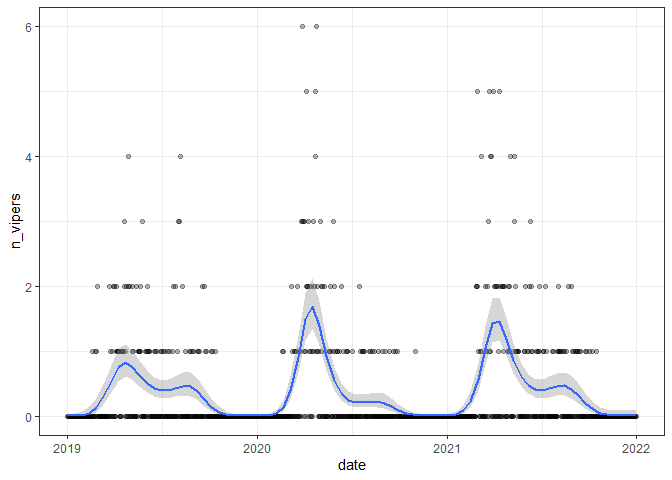
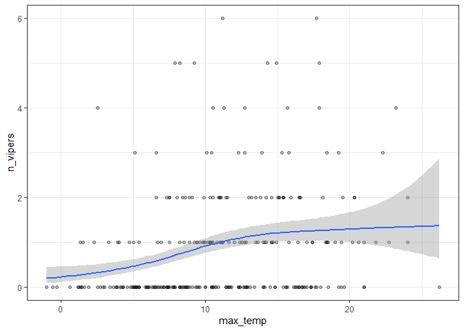
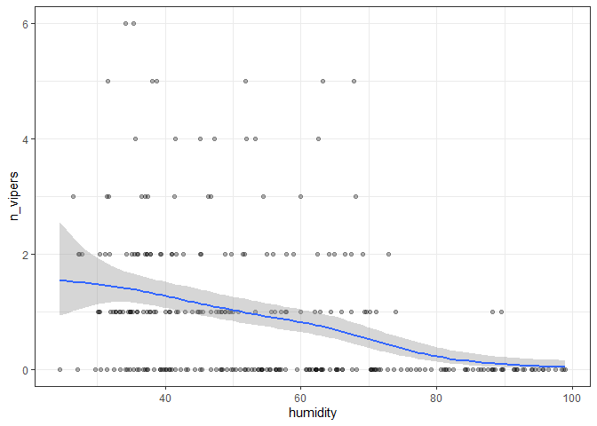
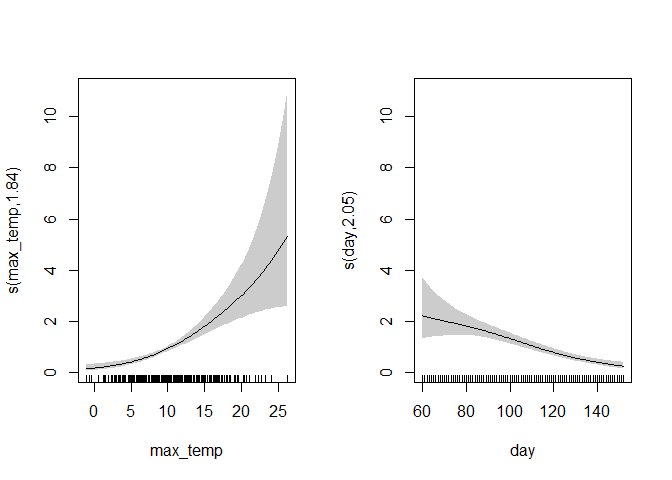

## Getting data

Dates of viper observations in Stockholms län 2019-2021 downloaded from
artportalen

``` r
library(tidyverse)
obs_dates <- read_csv("huggorm.csv")
obs_dates
```

    ## # A tibble: 395 x 1
    ##    date      
    ##    <date>    
    ##  1 2019-02-24
    ##  2 2019-04-20
    ##  3 2019-03-30
    ##  4 2019-02-26
    ##  5 2019-02-17
    ##  6 2019-04-18
    ##  7 2019-04-28
    ##  8 2019-04-17
    ##  9 2019-04-16
    ## 10 2019-04-15
    ## # ... with 385 more rows

Summarise as number of observations per date

``` r
daily_obs <- count(obs_dates, date, name = "n_vipers") 
daily_obs
```

    ## # A tibble: 248 x 2
    ##    date       n_vipers
    ##    <date>        <int>
    ##  1 2019-02-17        1
    ##  2 2019-02-24        1
    ##  3 2019-02-25        1
    ##  4 2019-02-26        2
    ##  5 2019-03-23        2
    ##  6 2019-03-24        1
    ##  7 2019-03-28        1
    ##  8 2019-03-30        2
    ##  9 2019-03-31        2
    ## 10 2019-04-04        1
    ## # ... with 238 more rows

Daily max temperature at Bromma airport downloaded from SMHI’s API

``` r
max_temp <- read_csv2("https://opendata-download-metobs.smhi.se/api/version/1.0/parameter/20/station/97200/period/corrected-archive/data.csv", skip = 8) %>% 
  select(date = `Representativt dygn`, max_temp = Lufttemperatur) %>% 
  filter(lubridate::year(date) %in% 2019:2021) %>% 
  mutate(max_temp = as.numeric(max_temp)) # Daily 
max_temp
```

    ## # A tibble: 1,096 x 2
    ##    date       max_temp
    ##    <date>        <dbl>
    ##  1 2019-01-01      6.8
    ##  2 2019-01-02      2.9
    ##  3 2019-01-03     -1.7
    ##  4 2019-01-04      3.7
    ##  5 2019-01-05      3.9
    ##  6 2019-01-06      1.4
    ##  7 2019-01-07      2.2
    ##  8 2019-01-08      2.1
    ##  9 2019-01-09      1.5
    ## 10 2019-01-10     -0.4
    ## # ... with 1,086 more rows

Hourly relative humidity (%) downloaded from SMHI’s API and summarised
as daily average over 10:00-18:00

``` r
humidity <- read_csv2("https://opendata-download-metobs.smhi.se/api/version/1.0/parameter/6/station/97200/period/corrected-archive/data.csv", skip = 8) %>% 
  select(date = Datum, time = `Tid (UTC)`, humidity = `Relativ Luftfuktighet`) %>% 
  filter(lubridate::year(date) %in% 2019:2021, 
         lubridate::hour(time) %in% 10:18) %>% 
  group_by(date) %>% 
  summarise(humidity = mean(humidity))
humidity
```

    ## # A tibble: 1,095 x 2
    ##    date       humidity
    ##    <date>        <dbl>
    ##  1 2019-01-01     80.8
    ##  2 2019-01-02     64.3
    ##  3 2019-01-03     84.2
    ##  4 2019-01-04     94.7
    ##  5 2019-01-05     91.7
    ##  6 2019-01-06     97.4
    ##  7 2019-01-07     96.8
    ##  8 2019-01-08     98.4
    ##  9 2019-01-09     86.6
    ## 10 2019-01-10     91.1
    ## # ... with 1,085 more rows

Join tables and add flag for weekend, day of year and flag for “wet”
weather (more than 60% relative humidity)

``` r
weather_data <- full_join(max_temp, humidity, by = "date")
weather_data
```

    ## # A tibble: 1,096 x 3
    ##    date       max_temp humidity
    ##    <date>        <dbl>    <dbl>
    ##  1 2019-01-01      6.8     80.8
    ##  2 2019-01-02      2.9     64.3
    ##  3 2019-01-03     -1.7     84.2
    ##  4 2019-01-04      3.7     94.7
    ##  5 2019-01-05      3.9     91.7
    ##  6 2019-01-06      1.4     97.4
    ##  7 2019-01-07      2.2     96.8
    ##  8 2019-01-08      2.1     98.4
    ##  9 2019-01-09      1.5     86.6
    ## 10 2019-01-10     -0.4     91.1
    ## # ... with 1,086 more rows

``` r
full_data <- left_join(weather_data, daily_obs, by = "date") %>% 
  mutate(n_vipers = ifelse(is.na(n_vipers), 0, n_vipers), # Turn NAs to zero
         weekend = ifelse(lubridate::wday(date) %in% c(1, 7), 1, 0), # Day 1=Sunday, 7=Saturday
         day = lubridate::yday(date), # Julian day
         wet = ifelse(humidity > 60, 1, 0),
         ) 
full_data
```

    ## # A tibble: 1,096 x 7
    ##    date       max_temp humidity n_vipers weekend   day   wet
    ##    <date>        <dbl>    <dbl>    <dbl>   <dbl> <dbl> <dbl>
    ##  1 2019-01-01      6.8     80.8        0       0     1     1
    ##  2 2019-01-02      2.9     64.3        0       0     2     1
    ##  3 2019-01-03     -1.7     84.2        0       0     3     1
    ##  4 2019-01-04      3.7     94.7        0       0     4     1
    ##  5 2019-01-05      3.9     91.7        0       1     5     1
    ##  6 2019-01-06      1.4     97.4        0       1     6     1
    ##  7 2019-01-07      2.2     96.8        0       0     7     1
    ##  8 2019-01-08      2.1     98.4        0       0     8     1
    ##  9 2019-01-09      1.5     86.6        0       0     9     1
    ## 10 2019-01-10     -0.4     91.1        0       0    10     1
    ## # ... with 1,086 more rows

## Exploratory

More vipers on weekends:

``` r
full_data %>% group_by(weekend) %>% 
  summarise(mean(n_vipers))
```

    ## # A tibble: 2 x 2
    ##   weekend `mean(n_vipers)`
    ##     <dbl>            <dbl>
    ## 1       0            0.319
    ## 2       1            0.465

More vipers on dry days (but winter months are wet!):

``` r
full_data %>% group_by(wet) %>% 
  summarise(mean(n_vipers))
```

    ## # A tibble: 3 x 2
    ##     wet `mean(n_vipers)`
    ##   <dbl>            <dbl>
    ## 1     0            0.722
    ## 2     1            0.145
    ## 3    NA            0

Smoothed daily averages, high-season in March-May:

``` r
full_data %>% ggplot(aes(x = date, y = n_vipers)) + 
  geom_point(alpha = .3) + 
  geom_smooth(method.args = list(family = "poisson"), method = "gam", formula = y ~ s(x, k = 15)) +
  theme_bw()
```

<!-- -->

High-season, less vipers on cold days:

``` r
full_data %>% filter(lubridate::month(date) %in% 3:5) %>% 
  ggplot(aes(x = max_temp, y = n_vipers)) + 
  geom_point(alpha = .3) + 
  geom_smooth(method.args = list(family = "poisson"), method = "gam") +
  theme_bw()
```

<!-- -->

High-season, less vipers on wet days:

``` r
full_data %>% filter(lubridate::month(date) %in% 3:5) %>% 
  ggplot(aes(x = humidity, y = n_vipers)) + 
  geom_point(alpha = .3) + 
  geom_smooth(method.args = list(family = "poisson"), method = "gam") +
  theme_bw()
```

<!-- -->

# Model fitting

This is tricky due to the complex interactions between weather, season,
people and vipers. Needs a clear goal. Simple example using a Poisson
regression model with smooth terms for day and max_temp (restricted to
high-season).

``` r
library(mgcv)
model_fit <- gam(n_vipers ~  s(max_temp, k = 10) + s(day, k = 10) + wet + weekend, 
                 family = "poisson", 
                 data = full_data %>% filter(lubridate::month(date) %in% 3:5))
summary(model_fit)
```

    ## 
    ## Family: poisson 
    ## Link function: log 
    ## 
    ## Formula:
    ## n_vipers ~ s(max_temp, k = 10) + s(day, k = 10) + wet + weekend
    ## 
    ## Parametric coefficients:
    ##             Estimate Std. Error z value Pr(>|z|)    
    ## (Intercept)  -0.2055     0.1001  -2.053  0.04008 *  
    ## wet          -0.7579     0.1792  -4.229 2.34e-05 ***
    ## weekend       0.4225     0.1338   3.158  0.00159 ** 
    ## ---
    ## Signif. codes:  0 '***' 0.001 '**' 0.01 '*' 0.05 '.' 0.1 ' ' 1
    ## 
    ## Approximate significance of smooth terms:
    ##               edf Ref.df Chi.sq p-value    
    ## s(max_temp) 1.845  2.347  49.58  <2e-16 ***
    ## s(day)      2.048  2.580  42.38  <2e-16 ***
    ## ---
    ## Signif. codes:  0 '***' 0.001 '**' 0.01 '*' 0.05 '.' 0.1 ' ' 1
    ## 
    ## R-sq.(adj) =  0.217   Deviance explained = 26.6%
    ## UBRE = 0.26624  Scale est. = 1         n = 275

Plots of smooth terms (max_temp and day)

``` r
plot(model_fit, pages = 1, shade = TRUE, trans = exp)
```

<!-- -->
